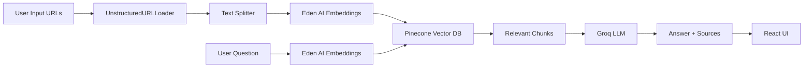

# 📰 RAG News Research Tool

An AI-powered full-stack web application that helps users gain deep insights from news articles using **Retrieval-Augmented Generation (RAG)**. Features a modern **Gemini-style chat interface** built with React and powered by cutting-edge AI services.


---

## 🎯 Problem Statement

In today's information-rich world, it's challenging to:

- **Read and analyze** multiple news articles quickly
- **Extract accurate insights** from various sources
- **Ask specific questions** about content across multiple articles
- **Verify information** with proper source attribution

**This tool solves these challenges** by allowing you to:
1. Input URLs of news articles (up to 10)
2. Process and index them automatically
3. Ask natural language questions in a chat interface
4. Get intelligent, concise answers with source citations

---

## ✨ Features

- 🎨 **Gemini-Style UI**: Beautiful, modern chat interface with smooth animations
- 🔗 **Multi-URL Processing**: Load up to 10 news articles simultaneously
- 🧠 **AI-Powered Q&A**: Ask questions in natural language
- 📚 **Source Attribution**: Every answer includes expandable source cards
- ☁️ **Cloud-Native**: No local storage, fully scalable
- 🌙 **Dark Mode**: Toggle between light and dark themes
- 📱 **Responsive Design**: Works seamlessly on desktop and mobile
- 🚀 **Fast & Efficient**: Optimized for production deployment

---

## 🏗️ Architecture

### Technology Stack

**Frontend:**
- React 18 + TypeScript
- Vite (Build tool)
- Context API (State management)
- Axios (API calls)
- React Markdown (Message rendering)
- Lucide React (Icons)

**Backend:**
- FastAPI (REST API)
- Pinecone (Vector database)
- Eden AI Embeddings (Cohere 4096-dim)
- Groq LLM (Llama 3.3 70B)
- LangChain (Document processing)

### Data Flow



---

## 📂 Project Structure

```
RAG-News-Tool/
├── backend/
│   ├── app.py                 # FastAPI main application
│   ├── config.py              # Environment configuration
│   ├── requirements.txt       # Python dependencies
│   └── services/
│       ├── preprocessing.py   # Document loading & chunking
│       ├── embedding.py       # Vector storage (Pinecone + Eden AI)
│       └── llm.py            # Answer generation (Groq)
├── frontend/
│   ├── src/
│   │   ├── components/       # React components
│   │   │   ├── Header.tsx
│   │   │   ├── Sidebar.tsx
│   │   │   ├── ChatContainer.tsx
│   │   │   ├── Message.tsx
│   │   │   ├── SourceCard.tsx
│   │   │   ├── InputBox.tsx
│   │   │   └── LoadingIndicator.tsx
│   │   ├── context/
│   │   │   └── AppContext.tsx # Global state (Context API)
│   │   ├── services/
│   │   │   └── api.ts         # API service layer
│   │   ├── types/
│   │   │   └── index.ts       # TypeScript types
│   │   ├── App.tsx            # Main App component
│   │   └── index.css          # Global styles (Gemini theme)
│   ├── package.json
│   └── vite.config.ts
├── .env                       # Environment variables (not in repo)
└── README.md
```

---

## 🚀 Quick Start

### Prerequisites

- **Python 3.10+** (tested on 3.13)
- **Node.js 18+** and npm
- API Keys for:
  - **Pinecone** (free tier available)
  - **Eden AI** (free tier available)
  - **Groq** (free tier available)

### Installation

#### 1. Clone the Repository

```bash
git clone <your-repo-url>
cd RAG-News-Tool
```

#### 2. Setup Environment Variables

Copy the example file and add your API keys:

```bash
cp .env.example .env
```

Edit `.env`:

```env
PINECONE_API_KEY=your_pinecone_api_key
PINECONE_INDEX_NAME=news-index
EDENAI_API_KEY=your_edenai_api_key
CHAT_GROQ_API_KEY=your_groq_api_key
```

#### 3. Setup Backend

```bash
cd backend

# Create virtual environment
python3 -m venv venv
source venv/bin/activate  # On Windows: venv\Scripts\activate

# Install dependencies
pip install -r requirements.txt
```

#### 4. Setup Frontend

```bash
cd ../frontend

# Install dependencies
npm install
```

### Running the Application

#### Terminal 1: Start Backend Server

```bash
cd backend
source venv/bin/activate  # Activate virtual environment
python app.py
```

Backend will run at: **http://localhost:8000**

#### Terminal 2: Start Frontend Dev Server

```bash
cd frontend
npm run dev
```

Frontend will run at: **http://localhost:5173**

### Open the Application

Navigate to **http://localhost:5173** in your browser.

---

## 📖 Usage Guide

### 1. Process News Articles

1. In the sidebar, enter news article URLs (1-10 URLs)
2. Click **🚀 Process URLs**
3. Wait for processing to complete (~10-30 seconds)

### 2. Ask Questions

1. Type your question in the input box at the bottom
2. Press **Enter** to send (Shift+Enter for new line)
3. View the AI-generated answer with source citations
4. Click on source cards to expand and see excerpts

### 3. Manage Data

- Click the **trash icon** in the header to clear all documents
- Click the **moon/sun icon** to toggle dark mode
- Use the **arrow** in sidebar to collapse/expand URL panel

---

## 🎨 UI Features

### Gemini-Inspired Design

- **Clean Layout**: Minimal clutter, focus on content
- **Smooth Animations**: Fade-in effects, hover states
- **Color Palette**: Professional blue accents with light/dark modes
- **Typography**: Google Sans-inspired font stack
- **Message Bubbles**: User messages (blue) and AI responses (gray)
- **Expandable Sources**: Click to view article excerpts
- **Auto-scroll**: Messages automatically scroll into view

---

## 🔧 Development

### Available Scripts

**Backend:**
```bash
cd backend
python app.py                    # Start FastAPI server
uvicorn app:app --reload        # Start with auto-reload
```

**Frontend:**
```bash
cd frontend
npm run dev                      # Start dev server
npm run build                    # Build for production
npm run preview                  # Preview production build
```

### Environment Variables

**Backend (.env):**
- `PINECONE_API_KEY`: Your Pinecone API key
- `PINECONE_INDEX_NAME`: Name of your Pinecone index
- `EDENAI_API_KEY`: Your Eden AI API key
- `CHAT_GROQ_API_KEY`: Your Groq API key

**Frontend (.env):**
- `VITE_API_URL`: Backend API URL (default: http://localhost:8000)

---

## 🌐 Deployment

### Backend (Render/Railway/Fly.io)

**Build Command:**
```bash
cd backend && pip install -r requirements.txt
```

**Start Command:**
```bash
cd backend && uvicorn app:app --host 0.0.0.0 --port $PORT
```

**Environment Variables:** Add all backend .env variables in the dashboard.

### Frontend (Vercel/Netlify)

**Build Command:**
```bash
cd frontend && npm run build
```

**Publish Directory:**
```
frontend/dist
```

**Environment Variables:**
- `VITE_API_URL`: Your deployed backend URL

---

## 🔍 API Documentation

Once the backend is running, visit **http://localhost:8000/docs** for interactive API documentation (Swagger UI).

### Endpoints

- `GET /` - Health check
- `POST /api/process-urls` - Process news article URLs
- `POST /api/ask` - Ask a question
- `POST /api/clear-index` - Clear all documents

---

## 🐛 Troubleshooting

### "Invalid API Key"
- Verify `.env` file has correct keys
- Ensure no extra spaces or quotes around keys

### "Dimension mismatch"
- Delete existing Pinecone index
- Restart backend to recreate with correct dimensions (4096)

### Import errors
- Ensure Python 3.10+
- Reinstall: `pip install -r requirements.txt --force-reinstall`

### CORS errors
- Check `VITE_API_URL` in frontend/.env matches backend URL
- Verify backend CORS settings in `config.py`

---

## 📝 License

This project is open-source and available under the MIT License.

---

## 🤝 Contributing

Contributions are welcome! Please feel free to submit a Pull Request.

---

## 📧 Contact

For questions or feedback, please open an issue on GitHub.

---

**Built with ❤️ using React, FastAPI, Pinecone, Eden AI, and Groq**
